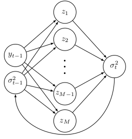

# Recurrent Neural Net predicting Stock volatility

  

This repository contains Python code to a recurrent Neural Network which tries to model the volatility of the daily returns of the SP500 index.

The first two scripts estimates the GARCH(1,1)-model and the Jordan Neural network with 5 hidden layers on the SP500 daily returns and saves the output in a JSON-file, named GARCH_est_<timestamp>.json, for the ARCH model and Jordan_est_<timestamp>.json for the Neural Network model.

The two scripts: VaR_GARCH and VaR_RNN produces some VaR plots which are saved in your_folder/plots.

## Data
 
The data come from Yahoo fianance https://finance.yahoo.com/q?s=^GSPC and is located in a CSV file in the data-folder.

